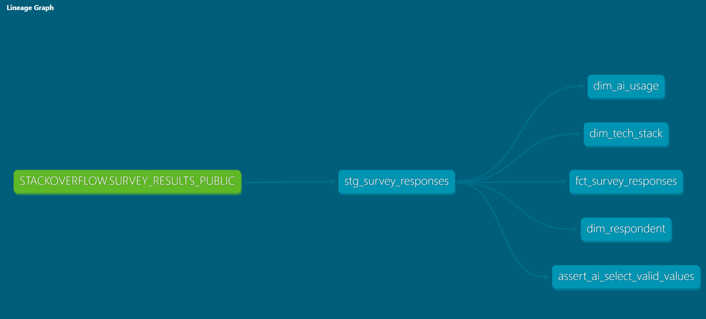

# Stack Overflow Developer Survey 2025 — dbt + Snowflake

End-to-end analytics engineering project built with dbt Core and Snowflake, using the Stack Overflow 2025 Developer Survey dataset (~49,000 responses). The goal is to transform raw survey data into a clean, tested, and documented dimensional model ready for BI consumption.

This project enables analysis of developer compensation by country and experience level, AI tool adoption trends across different developer profiles, and technology stack preferences — providing a structured foundation for dashboards or ad-hoc analysis on one of the largest annual developer surveys in the world.

---

## Stack

- **dbt Core 1.11** — transformation, testing, documentation
- **Snowflake** — cloud data warehouse
- **Python 3.13** — environment and dbt runtime

---

## Architecture

```
RAW (Snowflake)
└── SURVEY_RESULTS_PUBLIC       ← raw CSV loaded via Snowflake internal stage

STAGING (dbt views)
└── stg_survey_responses        ← column renaming, type casting, source declaration

MARTS (dbt tables)
├── dim_respondent              ← demographic and professional profile (age, country, education, employment, industry)
├── dim_tech_stack              ← languages, databases and platforms used by each respondent
├── dim_ai_usage                ← AI tool adoption frequency, sentiment, trust level and perceived job threat
└── fct_survey_responses        ← quantitative metrics: compensation (USD), coding experience, job satisfaction
```

---

## Lineage



---

## Project Structure

```
dbt_stackoverflow/
├── models/
│   ├── staging/
│   │   ├── stg_survey_responses.sql
│   │   └── _sources.yml           ← source and staging model documentation + tests
│   └── marts/
│       ├── dim_respondent.sql
│       ├── dim_tech_stack.sql
│       ├── dim_ai_usage.sql
│       ├── fct_survey_responses.sql
│       └── _marts.yml             ← marts documentation + tests
├── tests/
│   └── assert_ai_select_valid_values.sql
├── dbt_project.yml
└── profiles.yml                   ← not included, configure locally (see setup)
```

---

## Example Queries

**Average yearly compensation by country (top 10):**

```sql
SELECT
    r.country,
    ROUND(AVG(f.converted_comp_yearly), 0) AS avg_comp_usd,
    COUNT(*) AS respondents
FROM fct_survey_responses f
JOIN dim_respondent r ON f.response_id = r.response_id
WHERE f.converted_comp_yearly IS NOT NULL
GROUP BY r.country
ORDER BY avg_comp_usd DESC
LIMIT 10;
```

**AI tool adoption rate by developer type:**

```sql
SELECT
    r.dev_type,
    ai.ai_select,
    COUNT(*) AS respondents
FROM fct_survey_responses f
JOIN dim_respondent r ON f.response_id = r.response_id
JOIN dim_ai_usage ai ON f.response_id = ai.response_id
WHERE r.dev_type IS NOT NULL
GROUP BY r.dev_type, ai.ai_select
ORDER BY r.dev_type, respondents DESC;
```

**Median compensation by years of coding experience:**

```sql
SELECT
    years_code,
    MEDIAN(converted_comp_yearly) AS median_comp_usd,
    COUNT(*) AS respondents
FROM fct_survey_responses
WHERE converted_comp_yearly IS NOT NULL
  AND years_code IS NOT NULL
GROUP BY years_code
ORDER BY years_code;
```

---

## Setup

### 1. Clone the repository

```bash
git clone https://github.com/adrianffigueroa/stackoverflowsurvey2025.git
cd stackoverflowsurvey2025
```

### 2. Create virtual environment and install dependencies

```bash
python -m venv venv
source venv/bin/activate        # Mac/Linux
# venv\Scripts\activate         # Windows
pip install dbt-snowflake
```

### 3. Configure Snowflake connection

Create `~/.dbt/profiles.yml` with your Snowflake credentials:

```yaml
dbt_stackoverflow:
  target: dev
  outputs:
    dev:
      type: snowflake
      account: <your_account_identifier>
      user: <your_user>
      password: <your_password>
      role: ACCOUNTADMIN
      database: DBT_STACKOVERFLOW
      warehouse: COMPUTE_WH
      schema: DEV
      threads: 4
```

### 4. Load raw data

- Create a Snowflake internal stage in `DBT_STACKOVERFLOW.RAW`
- Upload `survey_results_public.csv` to the stage
- Use `INFER_SCHEMA` + `CREATE TABLE ... USING TEMPLATE` to create the table
- Load with `COPY INTO ... MATCH_BY_COLUMN_NAME = CASE_INSENSITIVE`

### 5. Run the project

```bash
dbt debug          # validate connection
dbt run            # build all models
dbt test           # run all tests
dbt docs generate  # generate documentation
dbt docs serve     # serve docs locally
```

---

## Tests

| Model                | Test                 | Column      |
| -------------------- | -------------------- | ----------- |
| stg_survey_responses | unique, not_null     | response_id |
| stg_survey_responses | not_null             | main_branch |
| stg_survey_responses | custom: valid values | ai_select   |
| dim_respondent       | unique, not_null     | response_id |
| dim_tech_stack       | unique, not_null     | response_id |
| dim_ai_usage         | unique, not_null     | response_id |
| fct_survey_responses | unique, not_null     | response_id |

---

## Dataset

[Stack Overflow Developer Survey 2025](https://www.kaggle.com/datasets/aliaslam25/stack-overflow-developer-survey-2025) — ~49,000 responses, 172 columns covering developer demographics, technology adoption, compensation, and AI tool usage.
